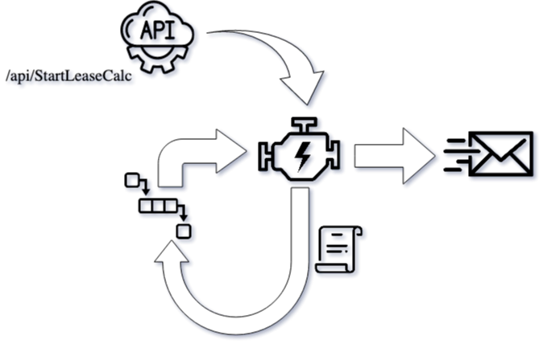

<div class="prise">
<h1>⚡LeaseCalc⚡</h1>
<span>An Azure Functions Project that calculates lease prices for vehicles!</span>
</div>

<br/> 
<div class="prise">
    <span>
        Powered by Prise:
    </span>
  <a href="https://merken.github.io/Prise">
    
  </a>
</div>

<br/>

## 📝 Table of Contents
- [📝 Table of Contents](#-table-of-contents)
- [🧐 About](#-about)
- [🗄️ Business Logic Repository](#️-business-logic-repository)
- [🧮 Azure Function Engine](#-azure-function-engine)
  - [🏁 StartLeaseCalc](#-startleasecalc)
  - [📜 JourneyFunction](#-journeyfunction)
  - [📦 ComponentFunction](#-componentfunction)
- [⚙️ Spin-Up Container](#️-spin-up-container)
- [⌛ TL;DR Getting Started locally](#-tldr-getting-started-locally)

## 🧐 About
<a name="about"></a>

This project demonstrates the concept of a **Business Logic Repository**, a store that contains small pieces of business logic.<br/>
The ⚡**Azure Functions**⚡ project acts as an **engine** that sequentially executes components that are stored in the **Business Logic Repository** through use of a **journey**.

Benefits of this approach:

- Deploy the engine (Azure Function) once, maintain the components in the **Business Logic Repository**
- Scalable, fast, thanks to **Azure**
- Backwards compatibility of older components, thanks to [Prise](https://merken.github.io/Prise)

The moot of the **LeaseCalc** application, is to calculate a monthly fee for leasing a vehicle. It demonstrates the possible implementation of a **journey-based calculation engine** using Azure Functions. Other possible implementations or use cases of this approach might be:
- Tax calculation
- Payroll calculation
- Insurance fee calculation
- ... 🤷?

## 🗄️ Business Logic Repository
<a name="businesslogicrepo"></a>

The **Business Logic Repository**, in this context, is a [NuGet](https://www.nuget.org/) server inside a Docker container made possible through the [BaGet project](https://loic-sharma.github.io/BaGet/).<br/>
In the context of ⚡LeaseCalc⚡, **BaGet** will contain all the versioned components (NuGet packages) that are invoked by the **engine (Azure Function)**.

## 🧮 Azure Function Engine
<a name="engine"></a>

The [Azure Function Engine](https://github.com/merken/LeaseCalc.Functions/tree/master/LeaseCalc.Functions) is the backbone of this application, this is a scalable, queue-based Azure Function, that sequentially executes a specified **journey** to completion.

The LeaseCalc.Functions engine consists of four Azure Functions:
- StartLeaseCalc HTTP Trigger API ('/api/StartLeaseCalc')
- JourneyFunction Queue Trigger ('leasecalc-journey-queue')
- ComponentFunction Queue Trigger ('leasecalc-component-queue')
- SendEmailFunction Queue Trigger ('leasecalc-email-queue')




### 🏁 StartLeaseCalc
The **StartLeaseCalc** function exposes an HTTP Api, which will need to provide the **calculation context**:
```json
{
    "leaseInformation": {
        "termInMonths": 60,
        "initialDownPayment": 5000,
        "kmsPerYear": 30000
    },
    "customerInformation": {
        "customerId": 123456,
        "customerCreditScore": 68,
        "emailAddress": "merken.maarten@gmail.com"
    },
    "driverInformation": {
        "firstName": "Maarten",
        "lastName": "Merken",
        "age": 31
    },
    "vehicleInformation": {
        "retailPrice": 45000.00,
        "brand": "AUDI",
        "model": "A4",
        "features": [
            {
                "featureCode": "DIESEL"
            },
            {
                "featureCode": "COMBUSTION_ENGINE"
            },
            {
                "featureCode": "AIRCO"
            }
        ]
    }
}
```
The **leaseInformation** parameter contains all the information about the service you're requesting.<br/>
The **customerInformation** parameter contains all the information about customer, the email address will be used to send the result of the calculation to.<br/>
The **driverInformation** parameter contains all the information about driver of the vehicle, this is used to calculate the insurance, for example.<br/>
The **vehicleInformation** parameter contains all the information about vehicle, the features of the vehicle greatly impact the monthly lease price.<br/>

This object is provided to the StartLeaseCalc function endpoint through the API: 
```http
POST <endpoint>/api/StartLeaseCalc/journey.v1
Content-Type: application/json

{
    "leaseInformation": {
        "termInMonths": 60,
        "initialDownPayment": 5000,
        "kmsPerYear": 30000
    },
    "customerInformation": {
        "customerId": 123456,
        "customerCreditScore": 68,
        "emailAddress": "merken.maarten@gmail.com"
    },
    "driverInformation": {
        "firstName": "Maarten",
        "lastName": "Merken",
        "age": 31
    },
    "vehicleInformation": {
        "retailPrice": 45000.00,
        "brand": "AUDI",
        "model": "A4",
        "features": [
            {
                "featureCode": "DIESEL"
            },
            {
                "featureCode": "COMBUSTION_ENGINE"
            },
            {
                "featureCode": "AIRCO"
            }
        ]
    }
}
```

Along with the calculation context, the API is provided with the **journey**.
The **journey** is a **json** file that contains all the information on **how to perform** the calculation, this file is **versioned**, meaning that you can retry a **previously-generated** journey to **re-calculate** a previously generated lease price.

Another benefit of this is that you could support **multi-tenancy**, with **each tenant** having its own **journey**, meaning you could **omit** certain calculation steps (components) from a specific tenant.

```json
{
    "journey": {
        "rentalPriceComponents": [
            "RentalPrice.Component,1.0.0"
        ],
        "residualValueComponents": [
            "Day1.Component,1.0.0",
            "BrandValue.Component,1.0.0",
            "EngineWear.Component,1.0.0",
            "FeatureBasedResidualValue.Component,1.0.0"
        ],
        "monthlyLeaseComponents": [
            "BruteMonthlyLease.Component,1.0.0"
        ],
        "servicesComponents": [
            "Insurance.Component,1.0.0",
            "MaintenanceCost.Component,1.0.0",
            "CustomerRisk.Component,1.0.0"
        ]
    }
}
```

This file is stored inside an **Azure Blob Container** called '**journeys**', it contains all the components (calculation steps) in sequential order, grouped in four main categories:
- rentalPriceComponents, this group contains the components that determine correct rental price
- residualValueComponents, contains the components that determine the residual value of a vehicle
- monthlyLeaseComponents, contains the components that calculate the monthly leasing price
- servicesComponents, contains the components that add additional costs on top of the raw monthly leasing price

This **journey** is provided as parameter to the StartLeaseCalc API endpoint:
```http
POST <endpoint>/api/StartLeaseCalc/journey.v1
...
```

The function will read the **journey** from the **journeys Blob Container**, add it to the calculation context and put a message on the 'leasecalc-journey-queue' **Azure Storage Queue** for pickup by the **JourneyFunction**

### 📜 JourneyFunction

This function is triggered by a message pushed to the '**leasecalc-journey-queue**' **Azure Storage Queue**. It will sequentially check which parts of the journey have been executed, based on breadcrumbs. When a component needs to be executed, it will put a message on the '**leasecalc-component-queue**', this message contains the calculation context and its previously calculated results.

When a component needs to be executed, the function exists, the **ComponentFunction** execute its logic and put a new message on the '**leasecalc-journey-queue**' so that the next component can be executed, resulting in a back-and-forward between the **JourneyFunction** and the **ComponentFunction** until all components are executed and the journey is completed.

Finally, the **JourneyFunction** will put a message on the '**leasecalc-email-queue**' containing all the results from the calculation.

### 📦 ComponentFunction

This function is triggered by a message put on the '**leasecalc-component-queue**', it will dynamically execute a part of the **journey** and store its results in the **calculation context**.

The **ComponentFunction** communicates with a NuGet server (BaGet), checks if the request component package and version exists, downloads that NuGet package to local disk and uses Prise to **extract** the nupkg file, instantiate the plugin and invoke the ```Calculate``` method on the ```ILeaseCalcComponent``` plugin interface. The resulting context is then put into a message and fed back to the '**leasecalc-journey-queue**', where the next component can be scheduled to be executed.

## ⚙️ Spin-Up Container
<a name="spinup"></a>

The [Spin-Up container](https://github.com/merken/LeaseCalc.Functions/tree/master/LeaseCalc.SpinUp) is a Docker container that serves the purpose of making sure the docker-compose environment is correctly setup and ready to use. This container consists of a .NET 5.0 console application that communicates with the Azure Storage account in order to ensure the 'journey' container exists and it contains the two required journey files:
- journey.v1.json
- journey.v2.json

## ⌛ TL;DR Getting Started locally

To get this project running locally, you need Docker and Docker Compose to be installed on your system, this project uses Linux containers.
First, run the various components of this project using Docker Compose, run the following command inside the root directory of this repo:
```shell
docker-compose up
```

This will start building the **LeaseCalc.SpinUp**, the **LeaseCalc.Insurance.Api** and the **LeaseCalc.Functions** projects.
Once built, it will launch the following containers in a network:
- nuget.server (based on ```loicsharma/baget```)
- storage.emulator (based on ```mcr.microsoft.com/azure-storage/azurite```)
- leasecalc.spinup (**LeaseCalc.SpinUp** project)
- leasecalc.insurance.api (**LeaseCalc.Insurance.Api** project)
- leasecalc.functions (**LeaseCalc.Functions** project)
  


Once up, you can browse to the BaGet UI on http://localhost:8080, notice that there's nothing there, we still need to push packages (components) to this **Business Logic Repository**.


Each component from the **LeaseCalc.Components** directory needs to be packaged and pushed to this **Business Logic Repository**, you can do this using the [Prise Publish Plugin Extension for VS Code](https://marketplace.visualstudio.com/items?itemName=MRKN.prise-publishpluginextension). 

Create a directory named ```_dist``` inside the **LeaseCalc.Components** directory to contain our packaged plugins.

```
mkdir _dist
```

After installing the VS Code extension, Right-click on each of the ```.csproj``` files from the following directories and select 'Publish Prise Plugin as NuGet package':

- LeaseCalc.Components/**BrandValue.Component**/BrandValue.Component.csproj
- LeaseCalc.Components/**BruteMonthlyLease.Component**/BruteMonthlyLease.Component.csproj
- LeaseCalc.Components/**CustomerRisk.Component**/CustomerRisk.Component.csproj
- LeaseCalc.Components/**Day1.Component**/Day1.Component.csproj
- LeaseCalc.Components/**EngineWear.Component**/EngineWear.Component.csproj
- LeaseCalc.Components/**FeatureBasedResidualValue.Component**/FeatureBasedResidualValue.Component.csproj
- LeaseCalc.Components/**Insurance.Component**/Insurance.Component.csproj
- LeaseCalc.Components/**MaintenanceCost.Component**/MaintenanceCost.Component.csproj
- LeaseCalc.Components/**RentalPrice.Component**/RentalPrice.Component.csproj

The ```_dist``` directory should now contain **9 nupkg files**.


You can push these files to the local BaGet NuGet server using the upload-packages.sh script or these manual dotnet cli commands:
```shell
dotnet nuget push -s http://localhost:8080/v3/index.json LeaseCalc.Components/_dist/BrandValue.Component.1.0.0.nupkg
dotnet nuget push -s http://localhost:8080/v3/index.json LeaseCalc.Components/_dist/BruteMonthlyLease.Component.1.0.0.nupkg
dotnet nuget push -s http://localhost:8080/v3/index.json LeaseCalc.Components/_dist/CustomerRisk.Component.1.0.0.nupkg
dotnet nuget push -s http://localhost:8080/v3/index.json LeaseCalc.Components/_dist/Day1.Component.1.0.0.nupkg
dotnet nuget push -s http://localhost:8080/v3/index.json LeaseCalc.Components/_dist/EngineWear.Component.1.0.0.nupkg
dotnet nuget push -s http://localhost:8080/v3/index.json LeaseCalc.Components/_dist/FeatureBasedResidualValue.Component.1.0.0.nupkg
dotnet nuget push -s http://localhost:8080/v3/index.json LeaseCalc.Components/_dist/Insurance.Component.1.0.0.nupkg
dotnet nuget push -s http://localhost:8080/v3/index.json LeaseCalc.Components/_dist/MaintenanceCost.Component.1.0.0.nupkg
dotnet nuget push -s http://localhost:8080/v3/index.json LeaseCalc.Components/_dist/RentalPrice.Component.1.0.0.nupkg
```

After pushing these files, refresh the BaGet UI (http://localhost:8080) to see the pushed packages.


You're now ready to execute the StartLeaseCalc function using the ```StartLeaseCalc.http``` file in VS Code, using the [REST Client Extension](https://marketplace.visualstudio.com/items?itemName=humao.rest-client).

**Don't forget to provide an email address!**

Click the ```Send Request``` action above line #2 in the StartLeaseCalc.http file:


This kicks off the calculation for our **calculation context** using the ```journey.v1.json``` **journey**.


Depending on your local configuration, it might take some time for the entire journey to complete...
Eventually you will receive an email containing the result:


Now, with the setup still running, let's change the **BruteMonthlyLease.Component** logic, push the update to the **Business Logic Repository** (BaGet NuGet server) in the form of a new version of the **BruteMonthlyLease.Component** package.

Change the ```BruteMonthlyLease.cs``` file:
```csharp
using System;
using System.Threading.Tasks;
using LeaseCalc.Contract;
using Prise.Plugin;

namespace BruteMonthlyLease.Component
{
    [Plugin(PluginType = typeof(ILeaseCalcComponent))]
    /// This component calculates the brute monthly leasing fee
    public class BruteMonthlyLease : ILeaseCalcComponent
    {
        public Task<LeaseCalcContext> Calculate(LeaseCalcContext context)
        {
            var rentalPrice = context.LeaseCalculationInformation.RentalPrice;
            var vehicleResidualValueAfterTerm = context.LeaseCalculationInformation.VehicleResidualValue;
            var amountToLease = rentalPrice - vehicleResidualValueAfterTerm;

            context.LeaseCalculationInformation.MonthlyLeasePrice = amountToLease / context.LeaseInformation.TermInMonths;
            // Add this line, this adds EUR 10 to the monthly lease price
            context.LeaseCalculationInformation.MonthlyLeasePrice += 10;

            return Task.FromResult(context);
        }
    }
}
```

Update the ```BruteMonthlyLease.Component.nuspec``` file to indicate a new version:
```xml
<?xml version='1.0'?>
<package>
    <metadata>
        <id>BruteMonthlyLease.Component</id>
        <title>BruteMonthlyLease.Component</title>
        <!-- Update the version -->
        <version>1.0.1</version>
        <authors>LeaseCorp</authors>
        <owners>Maarten Merken</owners>
        <description>BruteMonthlyLease.Component</description>
        <copyright>Copyright 2020</copyright>
        <tags></tags>
        <icon>icon.png</icon>
    </metadata>
    <files>
        <file src='bin/Debug/netcoreapp2.1/publish/*.*' target='lib/netcoreapp2.1' />
        <file src="../icon.png" target="icon.png" />
    </files>
</package>
```

Re-publish the package using Right-click on the ```BruteMonthlyLease.Component.csproj``` file and select 'Publish Prise Plugin as NuGet package':


A new version of the ```BruteMonthlyLease.Component``` will be created inside of the ```_dist``` directory.


Push this package to the **Business Logic Repository** (BaGet NuGet server) using the following command:

```shell
dotnet nuget push -s http://localhost:8080/v3/index.json _dist/BruteMonthlyLease.Component.1.0.1.nupkg
```

Observe the new package in the BaGet UI http://localhost:8080/


Re-execute the function using the v2 journey:


After the journey execution completes, you will find a new email in your inbox containing a new price:


You can **retry the v1 journey** (using **1.0.0** of the BruteMonthlyLease.Component), this will result in the **same original price**. 🎉 🙌
